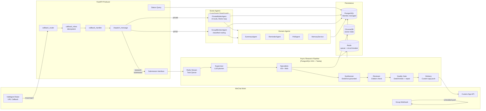
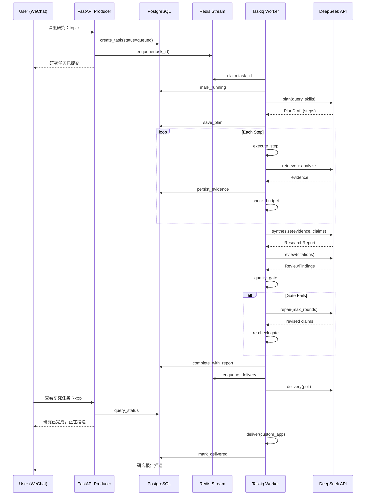

# Personal Butler Agent — Architecture Diagrams

## Overall System Architecture

## Research Pipeline Sequence

## Trade-off Notes

### PostgreSQL Authoritative vs Redis Transport

- **PostgreSQL is authoritative**: all task state, plans, evidence, and reports live in PG. The Redis Stream carries only the task_id. If Redis loses the queue, workers re-query PG and recover. This prevents split-brain between queue state and DB state.
- **Redis is a transport, not a store**: we use it for producer-worker decoupling, not state persistence. Feature-gated (`RESEARCH_ENABLED` defaults false) to preserve zero-dependency startup.
- **Trade-off**: SQLite concurrent writers (API + 3 workers) may show `database is locked` under high load. PostgreSQL migration (Alembic-managed) addresses this.

### LangGraph for Scene Agents vs Durable DAG for Research

- **LangGraph StateGraph**: ideal for interactive agents where latency matters (sub-second ReAct loops). Checkpointing via MemorySaver gives multi-turn conversation memory. Every user message enters a fresh graph invocation.
- **Durable DAG (PostgreSQL rows)**: research steps are first-class DB entries with leases. Workers claim via row locks. Expired leases auto-recover. Plans are versioned and side-effect-free until approved.
- **Why not use LangGraph for research**: research runs can take minutes, involve multiple LLM calls, and span process boundaries (producer -> queue -> worker). LangGraph's StateGraph is designed for in-process, single-invocation agent loops. PostgreSQL rows with leases provide the durability and recovery that async workflows need.
- **Why not use DAG for scene agents**: scene agents respond to user messages in < 3 seconds. Writing each tool call as a DB step would add unacceptable latency. The DAG overhead (leases, row locks, recovery) is unnecessary when the agent completes in a single graph invocation.

### Dynamic Tools Default Denied

- The `ResearchToolRegistry` enforces a permission policy chain: system admin -> workspace admin -> workspace permission -> tool policy -> default denied.
- Any tool without an explicit permission rule is **denied by default** at registration time, not at call time. This prevents accidental capability exposure when new tools are added.
- **Trade-off**: adding a new research tool requires updating the tool manifest and the security policy. This is intentional: every tool should be explicitly reviewed before it becomes available to LLM planners.

### Delivery Separate from Research Execution

- Research execution and report delivery are independent Taskiq tasks. If delivery fails, the completed report is preserved in PG and can be re-delivered. If research fails, delivery is never enqueued.
- This isolation prevents cascading failures: a transient WeChat API issue during delivery doesn't invalidate an otherwise correct research report.
- **Trade-off**: an additional async hop means the user waits slightly longer for delivery notification. For async research (minutes of LLM time), the extra few seconds are negligible.
